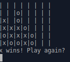

# Chess
An assignment from [The Odin Project](https://www.theodinproject.com/) to implement a two player game of Connect Four using Ruby.

Additional information can be found at https://www.theodinproject.com/lessons/ruby-connect-four

## How to Play

| <code>ruby lib/game.rb</code>

An image of the six columns will be displayed along with whose turn it currently is and a prompt for input.
Input is a number from 1 to 7, with 1 being the leftmost column and 7 the rightmost column.

Information on valid input and innwers will be printed in the console.

## Features

- Ensures the players can only input valid moves.
- Checks and indicates when a player gets four in a row.

## Technologies
- Written in Ruby.
- Git for version control
- rspec for unit tests